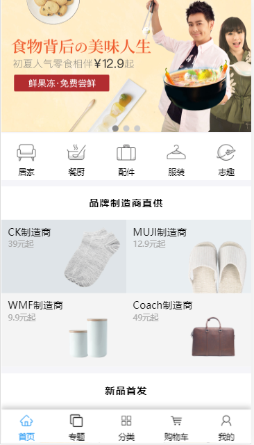
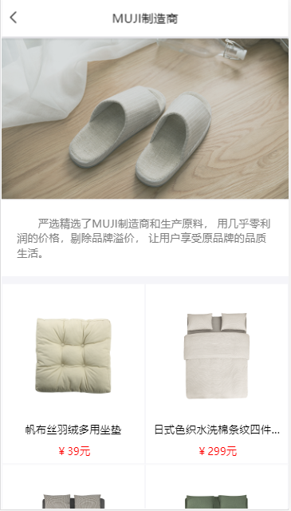
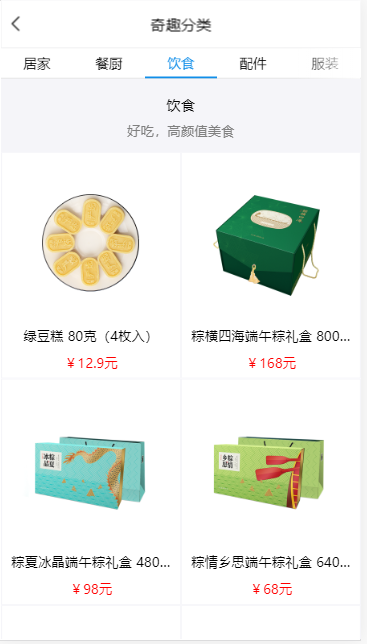
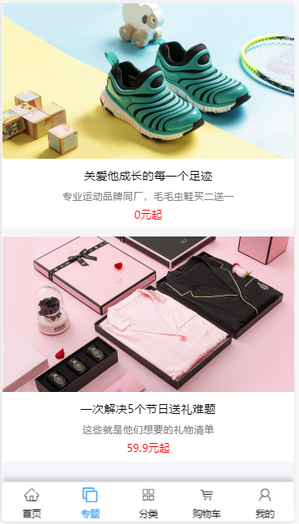
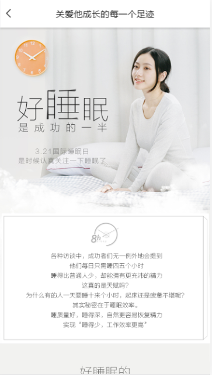
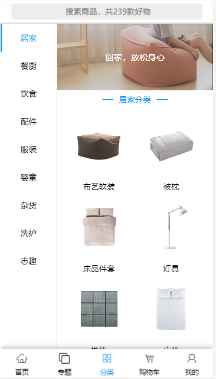
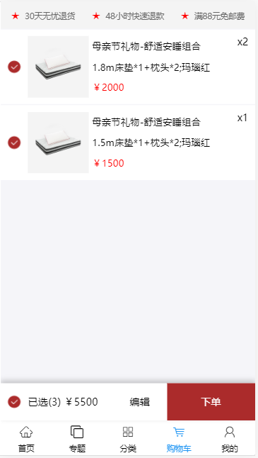
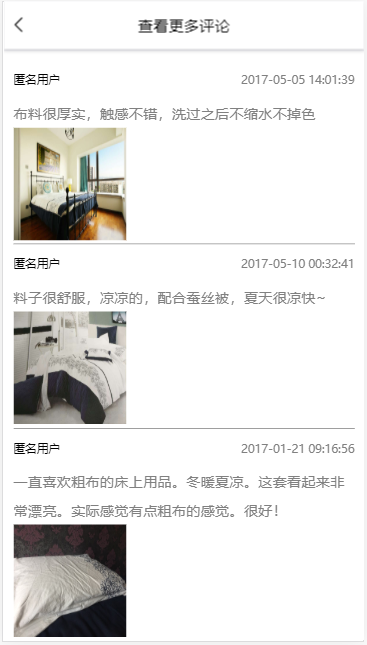
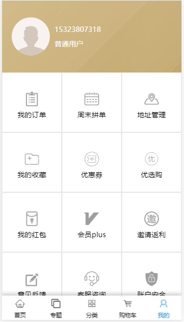

​wangyi 是仿网易严选 UI 设计的 H5 webApp。项目是基于 React+mobx+better-scroll+Axios+React-router。 
​wangyi 采用阿里 antd-design-mobile 的 UI 组件。
- 主页面(仿网易严选)
    - 首页
        - 商品详情
        - 制造商详情
        - 专题详情
        - 奇趣分类
    
    - 专题
        - 专题详情
        - 查看评论
        - 添加评论
    - 分类
        -   商品分类
        -   模糊查找
        -   商品详情
            -   基础排版
            -   选择规格（遮罩弹框）
            -   评论（查看）
            -   大家都在看（跳转详情）
            -   购物车
            -   收藏
        -   添加购物车
        -   添加收藏
            -   判断商品是否被收藏
            -   添加/删除收藏
   
    - 购物车
        -   完成页面
            -   全选反选
            -   商品的数量和价格
        -   编辑页面
            -   商品的全选和反选
            -   数量的加减
            -   删除购物车里面的数据
    - 我的
        -   获取用户的信息
        -   我的收藏页面
            -   跳转到收藏商品的详情
            -   可删除收藏的商品
        -   地址管理页面
            -   获取所有的地址
            -   添加新地址
            -   修改地址
            -   删除地址

- 登录页面
    - 登录跳转到主页面

## 页面效果图

|         首页         |        制造商         |         商品分类         |         收藏商品         |
| :------------------: | :-------------------: | :----------------------: | :----------------------: |
|  |  |  |  |

|         专题          |          专题详情           |            分类检索            |                     
| :-------------------: | :-------------------------: | :----------------------------: | 
|  |  |  |  |

|        购物车        |          商品详情           |        更多评论         |         我的         |
| :------------------: | :-------------------------: | :---------------------: | :------------------: |
|  |  |  |  |

